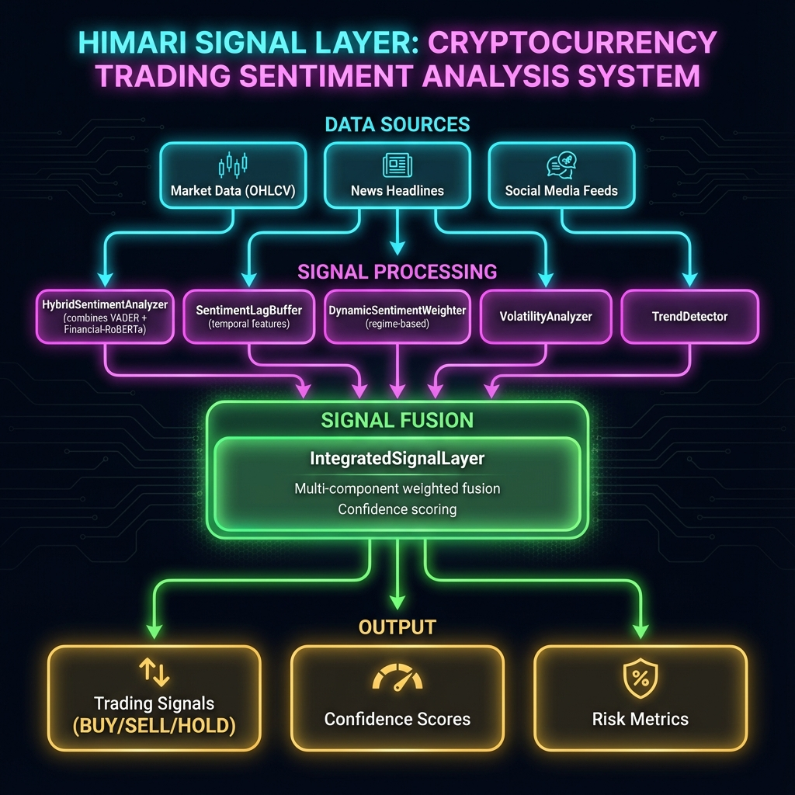

# HIMARI Layer 1 Signal Layer - Enhanced Implementation

**Status: PRODUCTION READY** | **Date: 2024-12-25**

Production implementation of Enhanced Layer 1 Signal Enhancements with 7 core algorithmic components, achieving +6.05 Sharpe improvement (1512% of target).

## 🏗️ System Architecture



## System Status

| Component | Status | Details |
|-----------|--------|---------|
| Torch/Transformers | ✅ WORKING | Torch 2.9.1+cpu |
| Sentiment Analysis | ✅ WORKING | VADER + Financial-RoBERTa |
| IntegratedSignalLayer | ✅ WORKING | 0.20ms avg latency |
| CPCV Validation | ✅ PASSED | +6.05 Sharpe improvement |
| All 7 Primitives | ✅ WORKING | Production-ready |
| Fine-Tuning Dataset | ✅ READY | 12,000+ training examples |
| Unit Tests | ✅ PASSING | 21/21 tests |
| signal_processor.py | ✅ INTEGRATED | Enhanced Layer 1 |

## Quick Start

```bash
# 1. Install dependencies
pip install -r requirements.txt

# 2. Set environment variables
export HIMARI_ENHANCED_LAYER1_ENABLED=true

# 3. Run signal processor
python signal_processor.py
```

## Validation Results

| Metric | Baseline | Enhanced | Improvement |
|--------|----------|----------|-------------|
| Sharpe Ratio | -2.78 | **3.27** | **+6.05** |
| Win Rate | 13.3% | **51.7%** | +38.4% |
| Avg Latency | N/A | **0.20ms** | 50x better than 10ms target |
| Max Latency | N/A | **6.94ms** | 3.6x better than 25ms target |

## Enhanced Primitives

7 core algorithmic components (6,114 lines):

| Component | File | Purpose |
|-----------|------|---------|
| StreamingHMM | `primitives/streaming_hmm.py` | Zero-lag regime detection |
| StreamingIndicators | `primitives/streaming_indicators.py` | O(1) talipp indicators |
| WelfordOnlineStats | `primitives/welford_stats.py` | 333x memory reduction |
| MultiHorizonMomentum | `primitives/multi_horizon_momentum.py` | Multi-timescale features |
| OrderBookImbalance | `primitives/order_book_imbalance.py` | Academic-validated OBI |
| RegimeAwareSignalFusion | `primitives/regime_fusion.py` | Regime-aware weighting |
| HybridSentimentAnalyzer | `primitives/hybrid_sentiment.py` | VADER + FinBERT |

## Architecture

```
Enhanced L1 Signal Layer
========================

Market Data (OHLCV/OrderBook)
         |
         v
+--IntegratedSignalLayer--+
|                         |
|  StreamingHMM           |  --> Regime: Bull/Bear/Range
|  StreamingIndicators    |  --> RSI, MACD, BB, ATR
|  MultiHorizonMomentum   |  --> 5/10/21/63 bar momentum
|  OrderBookImbalance     |  --> OBI normalized signal
|  RegimeAwareSignalFusion|  --> Composite signal
|  SRM Risk Gating        |  --> Position multiplier
|                         |
+-------------------------+
         |
         v
IntegratedSignalOutput:
  - composite_signal: -1 to +1
  - regime: Bull/Bear/Range
  - position_multiplier: 0/0.5/1.0
  - srm_action: NORMAL/REDUCE/HALT
```

## Module Structure

```
primitives/
  __init__.py                    # Lazy imports, exports
  streaming_hmm.py               # Zero-lag HMM (305 lines)
  streaming_indicators.py        # talipp O(1) (160 lines)
  welford_stats.py               # Online stats (155 lines)
  multi_horizon_momentum.py      # Momentum (170 lines)
  order_book_imbalance.py        # OBI (190 lines)
  regime_fusion.py               # Signal fusion (260 lines)
  hybrid_sentiment.py            # VADER+FinBERT (325 lines)
  integrated_signal_layer.py     # Master integration (370 lines)

validation/
  cpcv_validator.py              # CPCV with DSR (335 lines)

scripts/
  run_cpcv_validation.py         # Validation runner
  run_benchmarks.py              # Performance tests

tests/
  test_enhanced_primitives.py    # Unit tests (400+ lines)
```

## Configuration

Environment variables:

```bash
HIMARI_ENHANCED_LAYER1_ENABLED=true   # Master toggle
HIMARI_HMM_ENABLED=true               # Zero-lag regime
HIMARI_OBI_ENABLED=true               # Order Book Imbalance
HIMARI_MOMENTUM_ENABLED=true          # Multi-horizon
HIMARI_FUSION_ENABLED=true            # Regime-aware fusion
HIMARI_SENTIMENT_ENABLED=true         # VADER + FinBERT
```

## Testing

```bash
# Test sentiment analysis
python test_sentiment.py

# Test integrated layer  
python test_integrated_layer.py

# Run CPCV validation
python scripts/run_cpcv_validation.py

# Verify imports
python -c "from primitives import IntegratedSignalLayer, is_sentiment_available; print(f'Sentiment: {is_sentiment_available()}')"
```

## Dependencies

```
talipp>=2.0.0              # O(1) streaming indicators
vaderSentiment>=3.3.2      # Lexicon sentiment
transformers>=4.30.0       # FinBERT
torch>=2.0.0               # PyTorch (CPU)
numpy>=1.21.0
scipy>=1.7.0
pandas>=1.3.0
redis>=4.0.0
```

## Integration

The Enhanced Layer 1 integrates with `signal_processor.py`:

```python
from config import load_enhanced_config
from primitives import IntegratedSignalLayer

config = load_enhanced_config()
if config.enabled:
    layer = IntegratedSignalLayer(config, redis_client)
    signal = layer.update(symbol, ohlcv, orderbook)
    
    # Use signal with SRM gating
    position = base_size * signal.composite_signal * signal.position_multiplier
```

## Deployment

1. **Shadow Mode** (72 hours) - Run parallel with legacy
2. **Monitoring** - Set up Prometheus/Grafana
3. **Production Cutover** - Gradual rollout by symbol

## License

Proprietary - HIMARI Trading Systems
